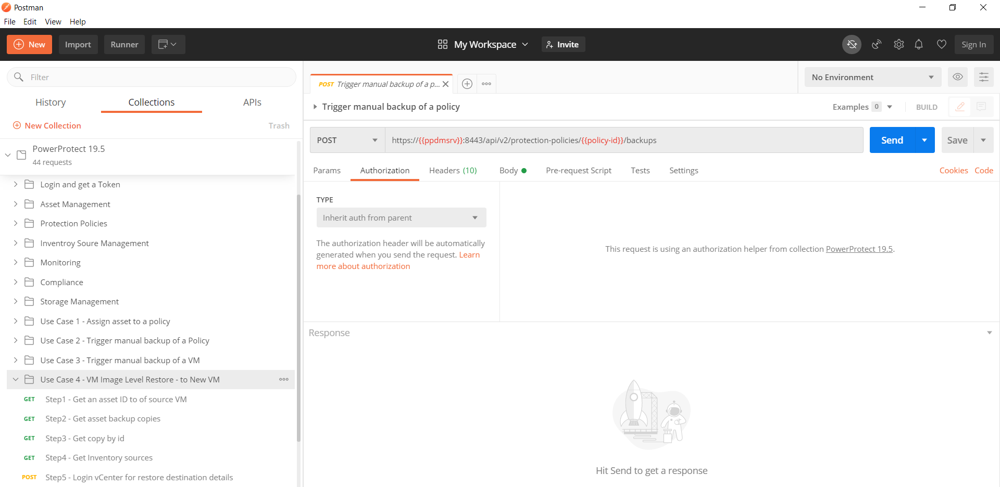

# DELLEMC-DPS-Postman-Collections-RESTAPIs
Postman collections for Dell EMC Data Protection APIs.

Postman collections are a collection of pre-defined REST API calls for a particular product or API. In this case, this repository has Postman collections for Dell EMC Data Protection Systems.

These collections are a great start to demonstrate REST API functionality of Dell EMC DPS Products.
All you need is, install Postman and import the collections along with the environment variables. You can download Postman here https://www.getpostman.com/downloads/.  


## Power Protect Data Manager (PPDM) 19.5
Once you import collections and environment variables (both are JSON), you need to modify the following environment variables.

```
ppdmsrv - enter your PPDM server or ip
ppdmuser - PPDM admin user id
ppdmpasswd - Password

vcenter-host - vcenter host/ip, only needed when you want to perform image restore of a VM
vcenter-username - vcenter username only needed when you want to perform image restore of a VM
vcenter-password - vcenter password only needed when you want to perform image restore of a VM
```

The rest of the variables will be updated automatically based on the API response.

How can you use this?
Try various calls (around 25 of them) and then try going through the use cases, such as adding assets to the policy, trigger manual backup of a VM or a policy or perform a Image Level restore of a VM.
The use cases require you to execute them sequentially, you can use "runner" option in the Postman and select the use case with all the tasks, it will execute all of them.

For example, the use case for performing an Image Level Restore of a VM requires all the 10 calls in the Use Case 4 to be executed.




# Content
* NetWorker  
  * NetWorker 19.1  
    * environment variables
    * Authenticate against a NW Server
  * NetWorker 18.2  
    * environment variables
    * Authenticate against a NW Server  
* Avamar  
  * Avamar 19.1
    * environment variables
    * Authenticate against an ave host  
  * Avamar 18.2
    * environment variables
    * Authenticate against an ave host  
* DataDomain
  * DataDomain
    * DDOS 6.2
        * environment variables
        * ReSt api automation collection
  * DataDomain Management Center
* PowerProtect
    * PowerProtect 19.1
      * environment variables
      * ReSt api automation collection
    * PowerProtect 19.5
      * environment variables
      * ReSt api automation collection